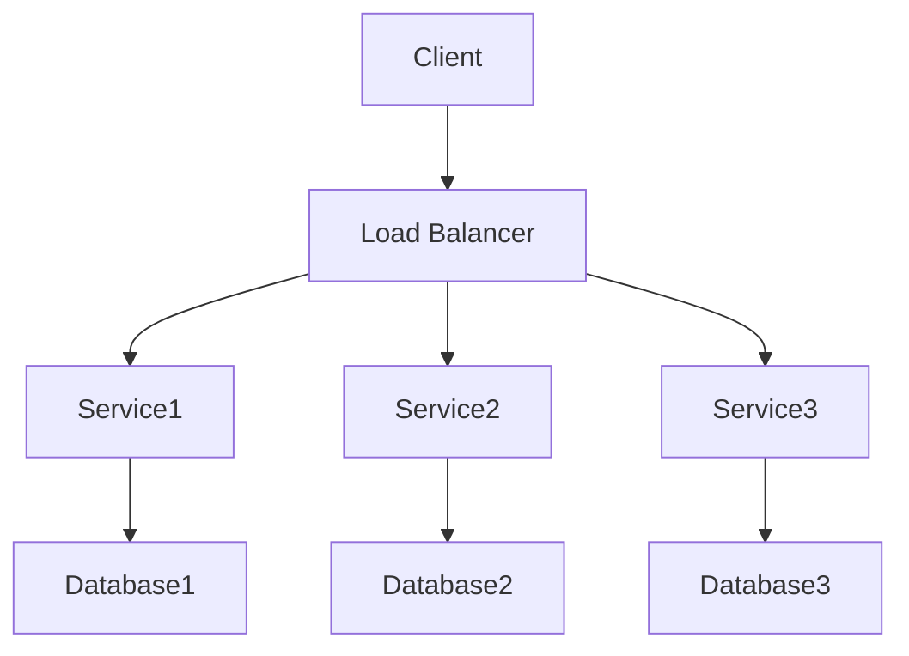

# Microservice Generator

This project is a Python-based microservice generator. It uses OpenAI's GPT model to generate Python microservices based on given prompts. The generated microservices include a web server for handling API requests and a business logic component, which could be a command-line interface (CLI) application or other component.

## Table of Contents

1. [How it Works](#how-it-works)
2. [How to Run](#how-to-run)
3. [Dependencies](#dependencies)
4. [Configuration](#configuration)
5. [Note](#note)

## How it Works

The main action of the project happens in main.py. Here's a simple guide to understand what it does:

1. First, you give a prompt that tells what kind of Python project you want to create. You can also give this prompt when you start the application by using the `-p` parameter like this:
   ```bash
   ./scripts/start_app.sh -p "Create me a cool microservice!"
   ```
2. This prompt goes to a function called `gpt_architector` in the file `gpt_generator/gpt_architector.py`. This function uses OpenAI's GPT model to plan the structure of the Python project and create all the files you need.
3. The gpt_architector function controls multiple smaller parts called gpt_worker threads, found in `gpt_generator/modules/worker.py`. Each `gpt_worker` gets the job of writing some of the code based on the project plan.
4. When all the `gpt_workers` are done, their outputs are gathered into two lists: `raw_responses` and `formatted_responses`.
5. The `raw_responses` list is saved in a special folder for checking later, while the `formatted_responses` list is used to make the actual files for the app.
6. In the end, you usually get a fully working microservice in `BASE_DIR` folder (check `.env.shared`).

## How to Run

To run the project, follow these steps:

1. Navigate to the project directory in your terminal.
2. Depending on your operating system, run one of the following commands:
   - For Unix-based systems (like Linux or MacOS), run the command `./scripts/start_app.sh`.
   - For Windows systems, run the command `./scripts/start_app.ps1`.

## Dependencies

The project requires the following dependencies:

- Python 3.12 or higher
- OpenAI-API key
- The `dotenv`, `openai` Python packages

These dependencies can be installed by running the command `pip install -r requirements.txt` in your terminal.

## Configuration

The project uses environment variables for configuration. These are loaded from `.env.shared` and `.env.secret` files by the `config` dictionary in `helpers/config.py`. The `.env.shared` file contains shared development variables, while the `.env.secret` file contains sensitive variables.

Please ensure that these files exist in your project directory and that they contain the necessary variables. For example, you will need to provide your OpenAI organization and API key.

### .env.shared

This file contains shared development variables:

Variable | Description
--- | ---
`ARCHITECTOR_PROMPT_VERSION` | The version of the architect prompt
`WORKER_PROMPT_VERSION` | The version of the worker prompt
`BASE_DIR` | The base directory for the microservices
`GPT_WORKER_MODEL` | The GPT model used by the worker
`GPT_ARCHITECTOR_MODEL` | The GPT model used by the architect

### .env.secret

This file contains sensitive variables:

Variable | Description
--- | ---
`GPT_ORG` | The OpenAI organization
`GPT_KEY` | The OpenAI API key


## Note

The generated Python projects are saved in a directory specified by the `BASE_DIR` environment variable. If this directory does not exist, it will be created.

